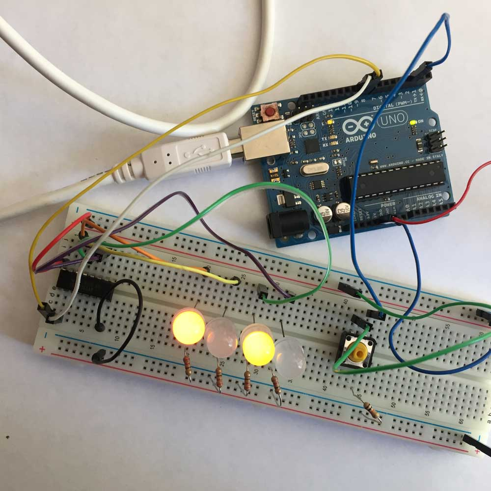

# 74HC163

The 74HC163 is a presettable synchronous 4-bit binary counter. This example simply counts from 0 through 15, and can be manually reset back to 0. The data inputs on the IC are unused.

- The Ardunio sends out a pulse to increment the count.
- LEDs display the current value of the counter.
- The button resets the counter back to 0.

