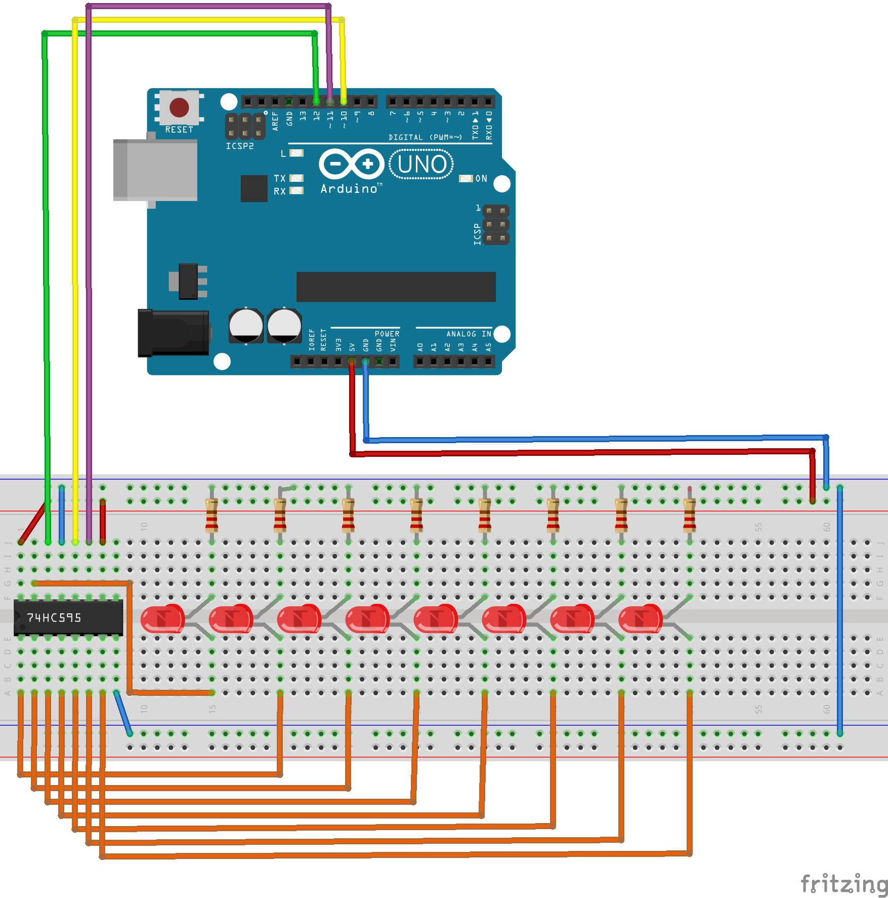

# 74HC595

The 74HC595 is an "8-Bit Shift Registers With 3-State Output Registers". The code increments from 0 through 255, and repeats while the LEDs display the status of the bits.

## Resources

- [Serial to Parallel Shifting-Out with a 74HC595](https://www.arduino.cc/en/tutorial/ShiftOut)
- [The 74HC595 Shift Register Tutorial](https://learn.adafruit.com/adafruit-arduino-lesson-4-eight-leds/the-74hc595-shift-register)

## Images

