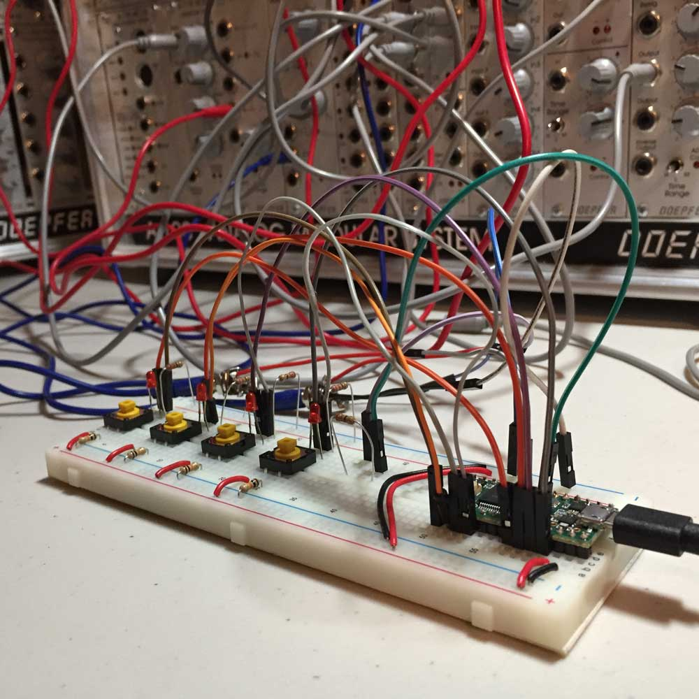
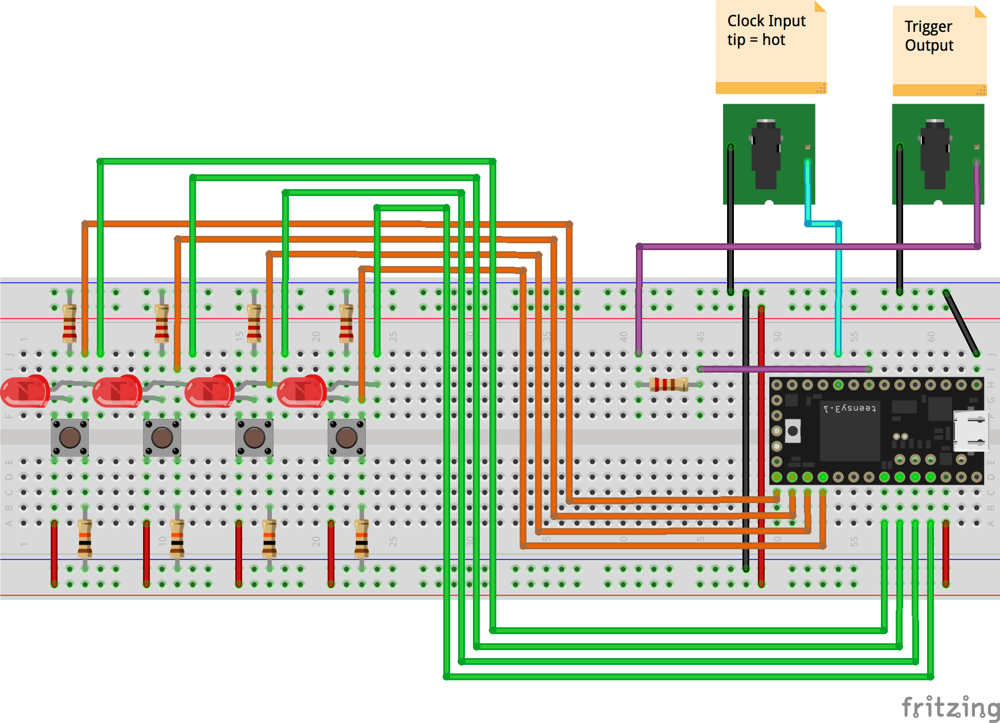

# 4-Step Trigger Sequencer

This Eurorack 4-Step Trigger Sequencer Prototype outputs a series of pulses based on user activated steps working in conjunction with other Eurorack modular synthesizers.

How Does it Work?

- The Clock Input receives an external pulse advancing the step position.
- Each button controls whether a particular Step outputs a pulse or not.
- The Output sends a pulse. The width of the pulse is directly tied to the width of the Clock Input pulse.
- The LEDs indicate the current step position (dim) and if the step is played (bright).

Why?

I want to upgrade my Eurorack modular synthesizer and I want to learn more about electronics. So why not both? This is the first step in achieving my long term goals. Also, finding info on Eurorack designs has proven difficult; If I start posting my findings, maybe others will too.

Future Upgrades

- 16 steps
- A Reset Input to better sync with other modules
- Plate Mounted
- Clipping circuit on input(s)
- Replace Teensy with ICs

