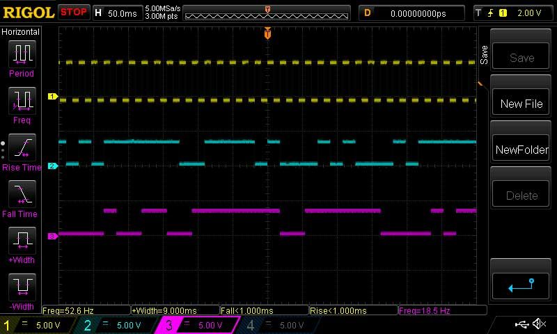
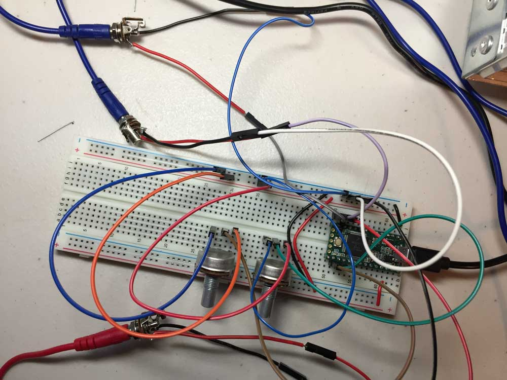

# Dual Random Pulse Generator

This prototype generates two randomized logic level outputs when triggered from a single logic level input. The random generators have distinct behaviors: The first acts as a weighted coin flip, the second acts as a flip-flop. Two potentiometers independently control the odds of their respective random generator.


## Parts
- x1 Teensy 3.1 / 3.2
- x2 10k linear potentiometers
- x3 3.5mm jacks
- x1 set of jumper wires

## The Random Generators

### Coin Flip

The first random generator acts as a weighted coin flip, generating a HIGH or LOW output depending on if the `random()` beats the odds or not.

```c
if (random(1024) < odds0) {
  digitalWrite(random0Pin, HIGH);
} else {
  digitalWrite(random0Pin, LOW);
}
```

### Flip-Flop

The second random generator acts as a flip-flop. When the `random()` is successful, the state of the output if flipped from HIGH to LOW or LOW to HIGH.

```c
if (random(1024) < odds1) {
  digitalWrite(random1Pin, flip);
  flip = !flip;
}
```

## Oscilloscope

Odds are set to approximately 50% for random generator.

- Yellow - The square wave used to trigger the generators.
- Cyan - The output of the coin flip generator.
- Magenta - The output of the flip-flop generator.



## What does it sound like?

I've been able mimic sounds from WarGames, modems, Atari 2600 noise, and Aunt Beru's kitchen with various patches. When the output signals are mixed and tuned, it functions as a random arpeggiator.

## Plans for the Future

- A clipping circuit to restrict voltage from exceeding 5V should be included in the final design.
- Replace Teensy with ATmega168 sans Arduino bootloader.
- Tidied up with a laser-cut faceplate that sits nicely with my other synth modules.
- LEDs to indicate the current state of each generator.

### Why?

1. I want to learn electronics.
2. I want to expand my Eurorack modular synthesizer.
3. There isn't a lot of a great information on how to build Eurorack modules, so I want to do my part in helping create resources for others.


