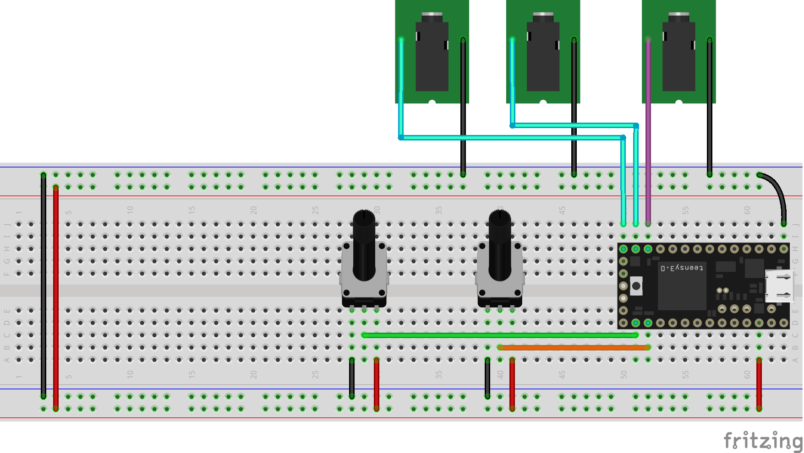

# Dual Random Pulse Generator

This prototype generates two randomized logic level outputs when triggered from a single logic level input. The random generators have distinct behaviors: The first acts as a weight coin flip, the second acts as a flip-flop. Two potentiometers independently control the odds of their respective random generator.



## The Random Generators

### Coin Flip

The first random generator acts as a weighted coin flip, generating a HIGH or LOW output depending on if the `random()` beats the odds or not.

```c
if (random(1024) < odds0) {
  digitalWrite(random0Pin, HIGH);
} else {
  digitalWrite(random0Pin, LOW);
}
```

### Flip-Flop

The second random generator acts as a flip-flop. When the `random()` is successful, the state of the output if flipped from HIGH to LOW or LOW to HIGH.

```c
if (random(1024) < odds1) {
  digitalWrite(random1Pin, flip);
  flip = !flip;
}
```

## What's Missing?

A clipping circuit to restrict voltage from exceeding 5V should be included in the final design.

## Parts
- x1 Teensy 3.1 / 3.2
- x2 10k linear potentiometers
- x3 3.5mm jacks
- x1 set of jumper wires
